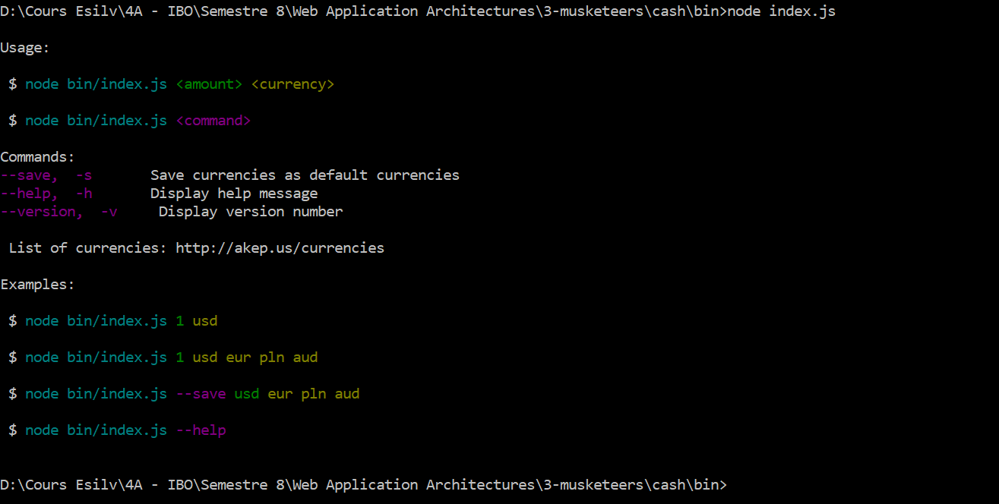
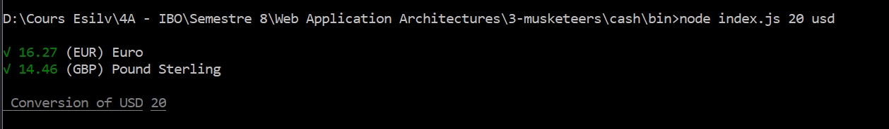
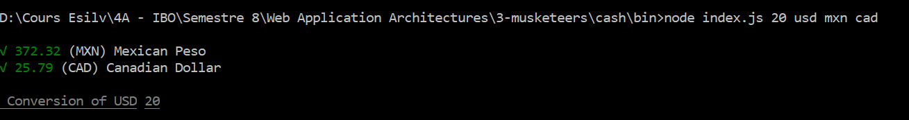
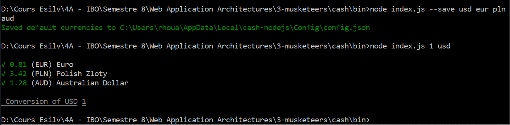

# 3 Musketeers

> RDD, CDD and TDD

<!-- START doctoc generated TOC please keep comment here to allow auto update -->
<!-- DON'T EDIT THIS SECTION, INSTEAD RE-RUN doctoc TO UPDATE -->
**Table of Contents**  *generated with [DocToc](https://github.com/thlorenz/doctoc)*

- [Requirement](#requirement)
- [Description](#description)
- [Usage](#usage)
  - [Conversion](#conversion)
  - [Save currencies](#save-currencies)
  - [Help](#help)
- [Structure of the project](#structure-of-the-project)
- [Usage](#usage)


<!-- END doctoc generated TOC please keep comment here to allow auto update -->

## Requirement

First of all, to launch the project we need a device with 'NodeJs' installed. You can install it [here](https://nodejs.org/en/)

Then, we have to install all the packages required for the project. To achieved that use the following commands :

* Move to the **Cash** directory :

```js
cd /cash/
```

* Install the packages :

```js
npm install
```

## Description

The module **Cash** permit to have the currency conversion of an input set in the terminal.

First of all, we can have access to a quick presentation of what can be done using *index.js*

- Run the following command :

```js
node /cash/bin/index.js
```
- After we have the following result :



To process the conversion and get the current rate, we use an **API** : *http://akep.us/currencies*

## Usage

### Conversion
To process a conversion, you have to precise the amount you want to convert and the currency.

- For example to convert 20 USD, we have to run the following command :

```js
node /cash/bin/index.js 20 USD
```

If you don't precise the currency you want, by default we obtain the conversion you want in **['USD', 'EUR', 'GBP']**

When you run the previous command, you'll obtain the following result :



If you want specific currencies, you have to add after the command the currency you want to calculate.

 - For example, you want to convert 20 USD in *Mexican Peso* & *Canadian Dollar* :



### Save currencies

With the *index.js* file, we can also update the default currencies with the following command :

```js
node /cash/bin/index.js --save usd eur pln aud mxn
```

With this command, we're going to set the default currencies to estimate, then when we want to estimate an amount of money the default currencies are usd eur pln aud mxn :



### Help

If you need some help, to know how to use the module, you can run the following command :

```js
node /cash/bin/index.js --help
```

## Structure of the project

In the folder **Cash**, we have several folders :

- bin : Contains all the **.js** files
- lib : Contains a file with all the currencies
- node-module : Contains all the packages installed
